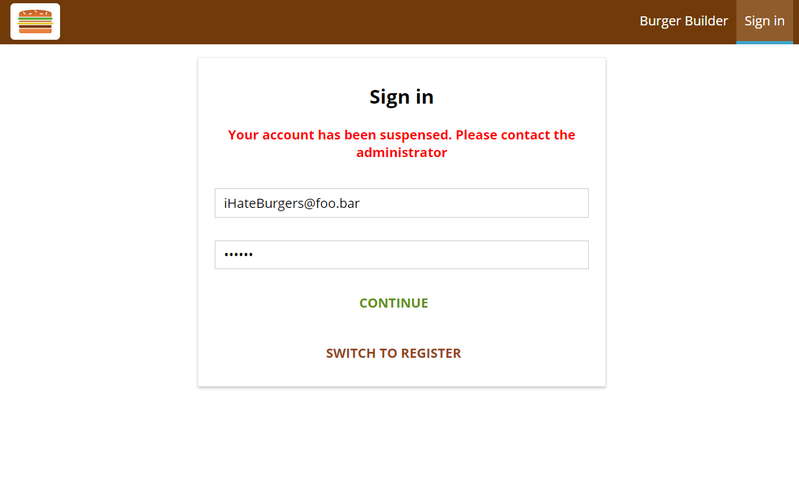
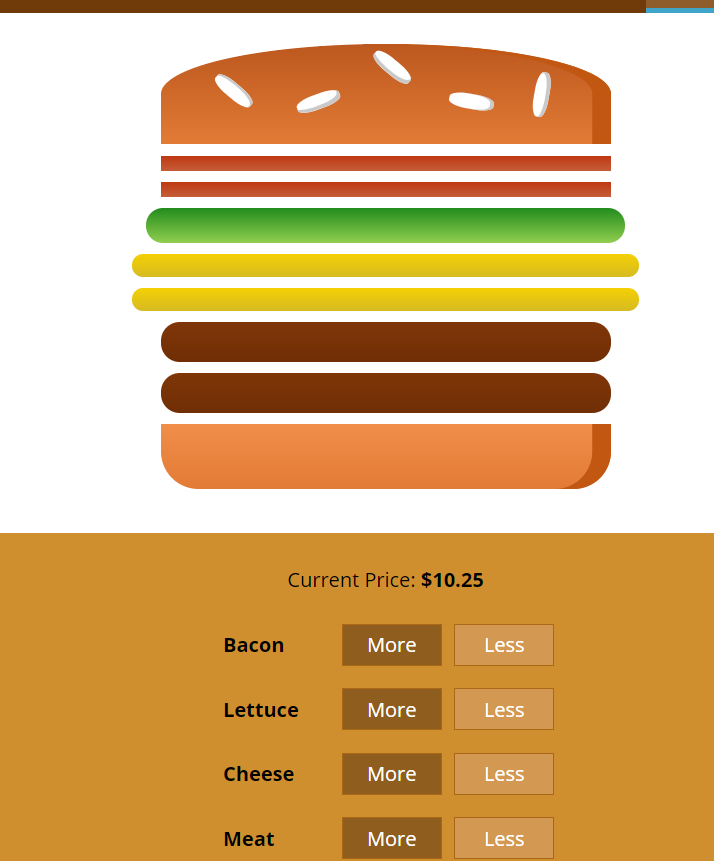
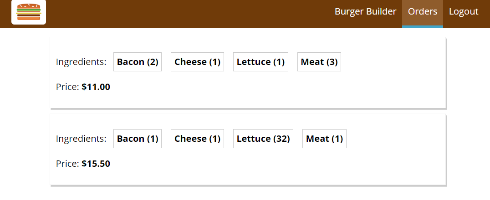
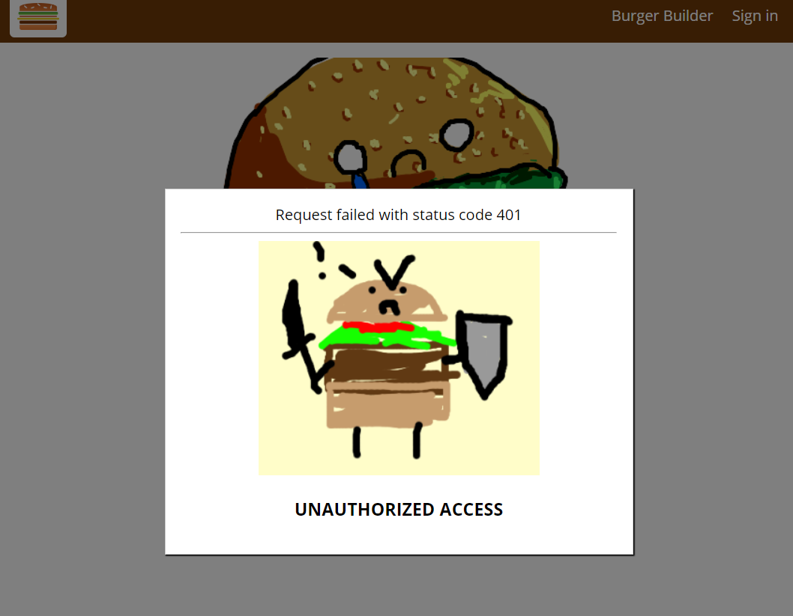

# Basic Burger Builder
Build a burger with react

This a (not so basic) build a burger app made by React.js with the help of Redux. This uses firebase to place all your delicious pixilated orders of burgers. 

## Features
In this burger builder you can build up a burger on the menu and it will be animated as you pick your ingredients. You just need to make an account to proceeed to the checkout to get your magnificent burger.

### Burger checkout preview

Once you purchase your burger just fill out a form with some basic information and your order will be confirmed!
### Order preview

### Security Features
There are some extra features where I did my best to focus on creating a secure environment for this app. I've even added a few custom error messages and features to show that I'm serious!

