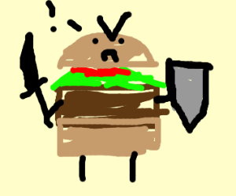

# Basic Burger Builder
Build a burger with react

This a (not so basic) build a burger app made by React.js with the help of Redux. This uses firebase to place all your delicious pixilated orders of burgers. 

## Features
In this burger builder you can build up a burger on the menu and it will be animated as you pick your ingredients. You just need to make an account to proceeed to the checkout to get your magnificent burger.

### Burger checkout preview

